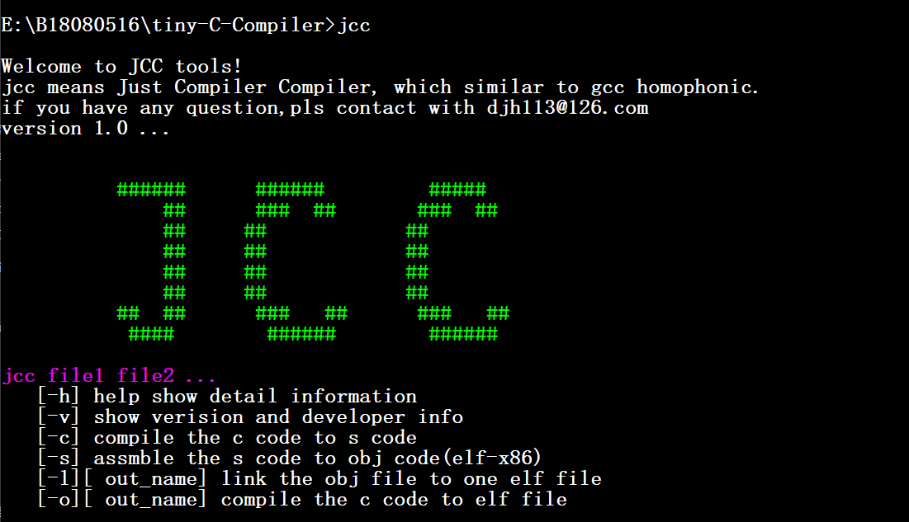

# tiny-C-Compiler
简化版`C`语言编译器，编译系统。

# 简介(Introduction)

`JCC`是一个`C`语言的编译系统，包括编译器(`compiler`)、汇编器(`assembler`)和链接器(`linker`)。最后可以产生`x86-elf`格式的可执行文件。`JCC`的含义是`Just Compiler Compiler`。



# How to compile

```bash
./run.sh
```

在`DOS`下执行编译脚本，能够产生对应的二进制文件，其中用到的`make`工具已经放置在`make_tool`中。若您对代码二次修改，同样可以执行上述命令，这样可以更新`JCC`。

编译源文件步骤，使用如下命令:

```bash
jcc.exe jcc src1 src2 ... [-option]
```

其中`src1`、`src2`等是一系列的源文件，最后是编译选项，选择不同的编译选项，可以得到不同的目标文件。

```bash
-c # 将源文件编译为汇编文件
-s # 将汇编文件汇编为目标文件
-l [output] # 链接多个目标文件,输出可执行文件,其中输出文件名可选,默认值为a.out
-o [output] # 将源文件一步编译为可执行文件,其中输出文件名可选,默认值为a.out
```

# 环境(Environment)

```bash
OS: windows 10/11
g++:(x86_64-posix-seh-rev0, Built by MinGW-W64 project) 5.4.0
# 注意,由于用到了一些C++11的语法特性,要求gcc版本不能过低,至少要支持c++11
# 主要有冲突的部分是unordered_map这一数据类型,如果编译器不支持,请修改对应的容器为hash_map
running env: linux(Ubuntu-i386)
# 由于产生的目标文件是elf(32bit),因此最后在上述虚拟机中测试
```

附:[虚拟机镜像地址](http://releases.ubuntu.com/16.04/)

# 细节(Detail)

参见`document`。

# END